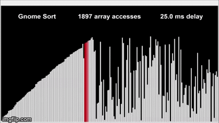
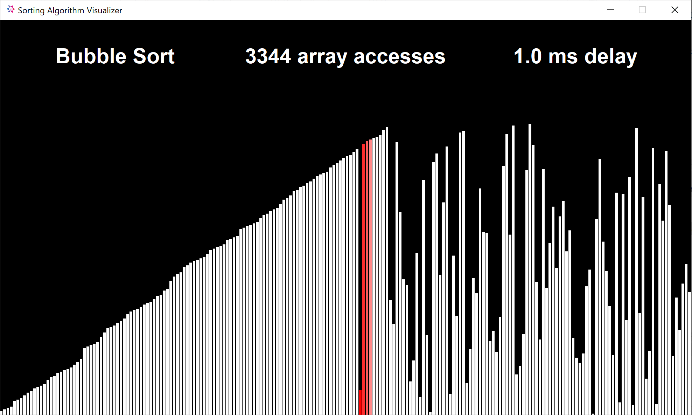
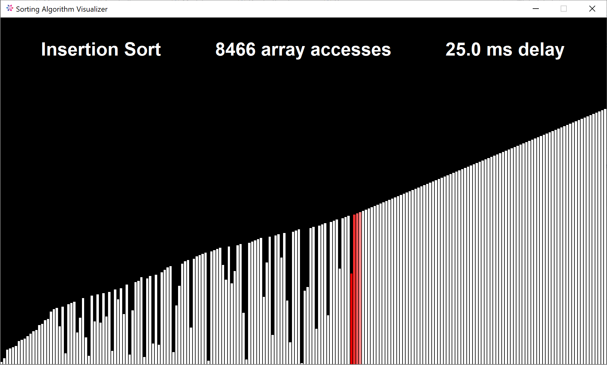
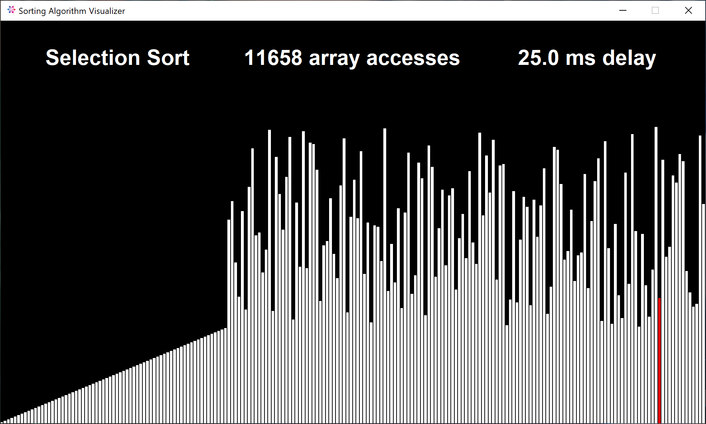
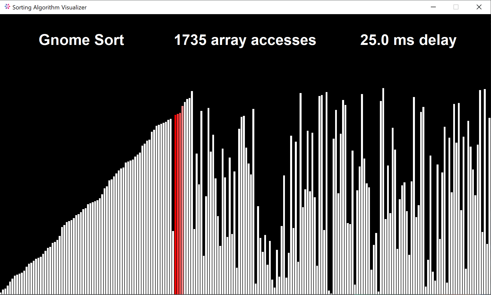
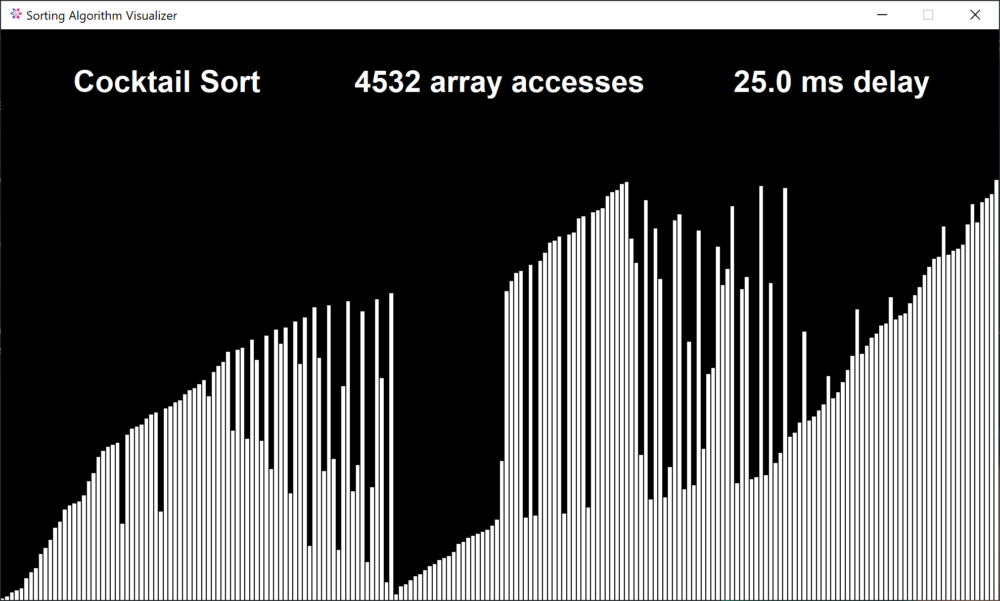

# Sorting Algorithm Visualizer

An application that graphically visualizes various sorting algorithms.

## Features

- Visualizes bubble sort, insertion sort, selection sort, gnome sort, and cocktail sort.
- Uses a color gradient on a few sorts to visualize swap comparisons.

## Demo

## FAQ

#### How do I run the application?

The application will run immediately after launching.

#### How do I stop the application?

The application will close after a brief delay when all sorting algorithm visualizations
are completed.

## Lessons Learned

The first challenge I came across was how to make the rectangle arrays fit neatly into the
program width. I overcame this challenge by making the program width and height constants 
instead of depending on the user's screensize. I optimized the program to fit the smallest 
common screen size people own, which is 1280x720.

The second challenge I faced was how to implement the state behavioral design pattern 
because I had difficulties decoupling object compositions and state behaviors into separate 
classes. I overcame this challenge using a similar concept known as the finite-state machine 
which can placed into a single class.

In this project, I learned how to overcome architectural and design pattern difficulties. 
In addition, I improved my knowledge of the Model-view-controller architectural pattern.

## Screenshots

